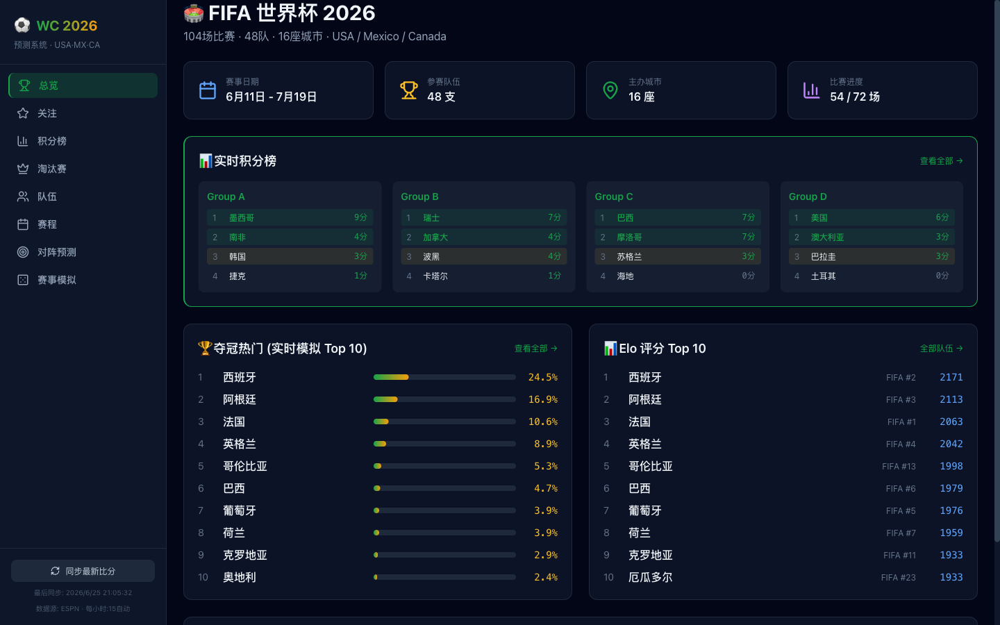
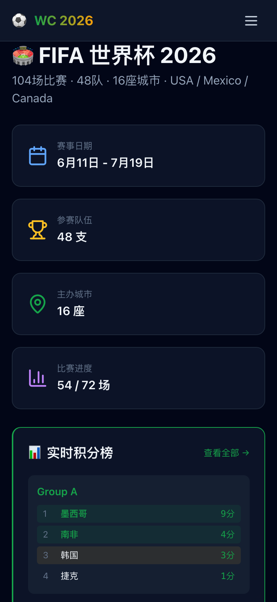
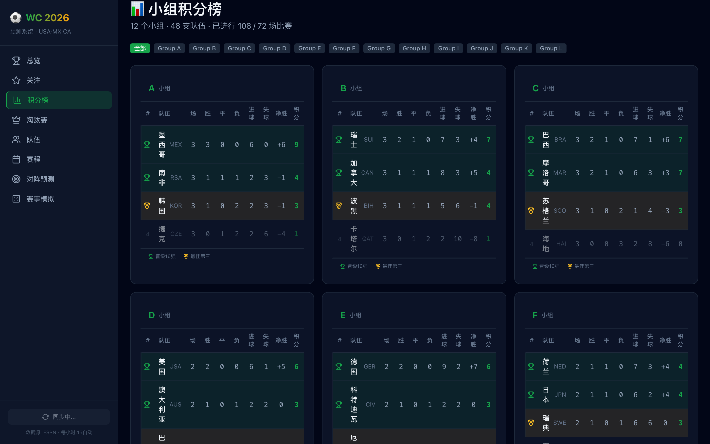
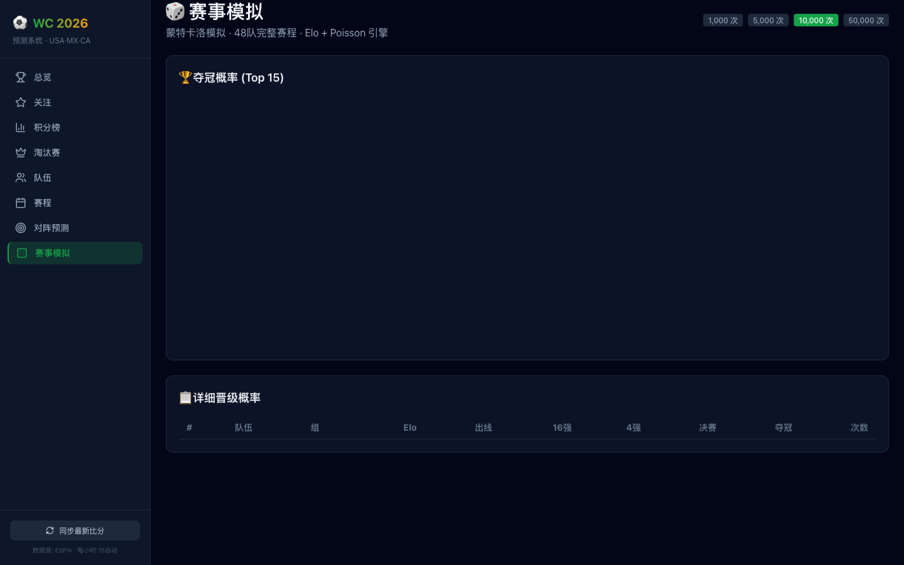
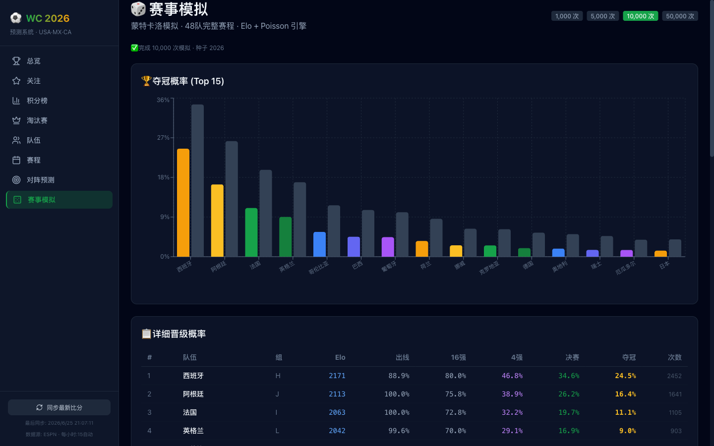

# 世界杯预测系统，我把它免费部署到了外网

世界杯期间各种竞猜活动参加不完。

之前 code 了一个预测系统：Elo 评分 + Dixon-Coles 泊松模型 + 蒙特卡洛模拟，还能自动同步 ESPN 比分、导入赛程到 Mac 日历。

但一直跑在本地，朋友想看还得发截图。

干脆部署到外网。**全程免费，不绑卡**。

---

## 效果

打开网址，48 支队伍、72 场赛程、实时积分榜、对阵预测、夺冠概率模拟，全部在线。



手机也能用：



---

## 技术栈

先说下架构，后面部署方案跟这个有关：

- **后端**：Python FastAPI，三层预测引擎，端口 8570
- **前端**：React + TypeScript + Tailwind，端口 5570
- **数据源**：ESPN API（免费、无需 key）

前后端分离，API 独立可调用。

---

## 选了哪个平台

调研了一圈免费方案：

| 方案 | 优点 | 缺点 |
|------|------|------|
| Vercel + Render | CDN 快、自动 HTTPS | Render 需绑卡、会休眠 |
| **Hugging Face Spaces** | 不绑卡、不休眠、16GB RAM | URL 长 |
| Cloudflare Tunnel | 零改动 | 电脑要一直开 |

最终选了 **Vercel + Render**（前端 Vercel，后端 Render），主要考虑 Vercel 的 CDN 确实快，而且世界杯期间流量大 Render 基本不会睡。

如果你不想绑卡，文章末尾也写了 HF Spaces 方案。

---

## 第一步：后端部署到 Render

打开 render.com，用 GitHub 登录。

**New → Web Service**，选你的仓库。

关键配置：

- **Root Directory**：`backend`
- **Build Command**：`pip install -r requirements.txt`
- **Start Command**：`bash start.sh`
- **Plan**：Free

点 Create，等 2-3 分钟构建完成。

Render 会给你一个 URL，类似：

```
https://你的项目名.onrender.com
```

验证一下，浏览器打开 `https://你的项目名.onrender.com/api/teams`，返回 JSON 就说明后端活了。

---

## 第二步：前端部署到 Vercel

打开 vercel.com，GitHub 登录。

**Add New Project**，选同一个仓库。

因为项目有 frontend 和 backend 两个目录，Vercel 会识别成 monorepo。**关键一步**：

- **Root Directory 设为 `frontend`**

不然构建会报错。

然后加一个环境变量：

- **Key**：`VITE_API_BASE`
- **Value**：`https://你的render域名/api`

这个变量告诉前端去哪找后端。本地开发时走 Vite proxy 不用管，生产部署必须设。

点 Deploy，1-2 分钟拿到 Vercel URL。

---

## 第三步：配 CORS

这一步最容易忘。

前后端分域名部署，浏览器有跨域限制。回到 Render，给后端加一个环境变量：

- **Key**：`CORS_ORIGINS`
- **Value**：`https://你的vercel域名.vercel.app`

不加的话，前端页面能打开，但所有数据请求全被浏览器拦截，页面空白。

---

## 踩过的坑

### Render 冷启动 50 秒

Render 免费层 15 分钟无访问会休眠，下次访问冷启动要等 50 秒。

用户第一次打开可能看到空白——API 请求超时了。

**解决方案**：前端加了 localStorage 缓存层。API 请求 15 秒超时后自动回退到上次缓存的数据，顶部显示橙色提示条：

> 服务器响应超时，显示的是 30 分钟前的缓存数据 [重试]

第二次访问就秒开了，缓存 survives 页面切换和浏览器重启。

另一个办法是 **UptimeRobot 保活**：免费服务，每 5 分钟 ping 一次后端 `/api/sync/status`，服务就不会休眠。

### Vercel 构建报错

第一次部署失败，报错 `tsc -b` 编译失败。

原因是用了一个环境变量 `import.meta.env.VITE_API_BASE`，但 TypeScript 不认识 `import.meta.env` 的类型。

加一个 `vite-env.d.ts` 文件就行：

```typescript
/// <reference types="vite/client" />

interface ImportMetaEnv {
  readonly VITE_API_BASE?: string;
}

interface ImportMeta {
  readonly env: ImportMetaEnv;
}
```

Vite 项目用环境变量一定要加这个声明文件，不然生产构建过不了。

### fixtures.json 不能 gitignore

一开始把 `fixtures.json`（赛程数据）当运行时产物 gitignore 了。

结果线上部署直接崩——`/api/fixtures` 和 `/api/sync/refresh` 全部 500。

这个文件本质是种子数据（72 场赛程 + 比分），ESPN 同步是就地更新它，不是从零生成。**必须提交到 git**。

---

## 最终效果

打开网址：

**总览页**——夺冠概率 Top 10、Elo 评分排行、比赛进度、晋级预测，一目了然。


**积分榜**——12 个组实时积分，完赛自动更新。



**对阵预测**——选两队，Dixon-Coles 模型算胜平负概率、预期进球、最可能比分、BTTS、大小球。



**蒙特卡洛模拟**——全 48 队赛程模拟 1 万次，看谁最可能夺冠。



---

## 不想绑卡？HF Spaces 方案

Hugging Face Spaces 完全免费、不绑卡、不休眠。

一个 Docker 容器同时跑前后端：

1. 注册 huggingface.co
2. New Space → SDK 选 Docker
3. 推送代码，Dockerfile 自动构建

前端 build 产物塞进 `backend/static/`，FastAPI 检测到静态目录后自动挂载。一个容器、一个 URL，搞定。

缺点是 URL 比较长：`https://用户名-项目名.hf.space`。

---

## 关于数据更新

后端用 APScheduler 定时任务，比赛日每小时 :15 自动从 ESPN 同步比分。

前端有手动同步按钮，点了立即拉最新数据。

不需要人工干预，比赛打完比分自动就更新了。

---

## 开源了

项目放到了 GitHub，README 写了完整部署教程，三种方案都有。

感兴趣的话，fork 一份自己部署，世界杯期间给朋友炫一下。

---

*纯属娱乐，预测仅供参考，理性参与。*
