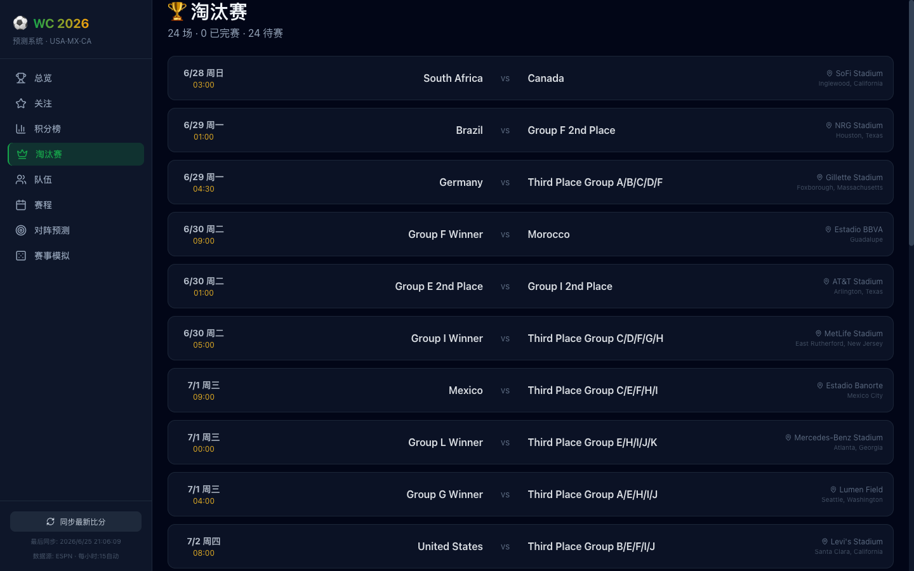
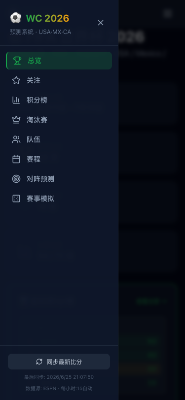
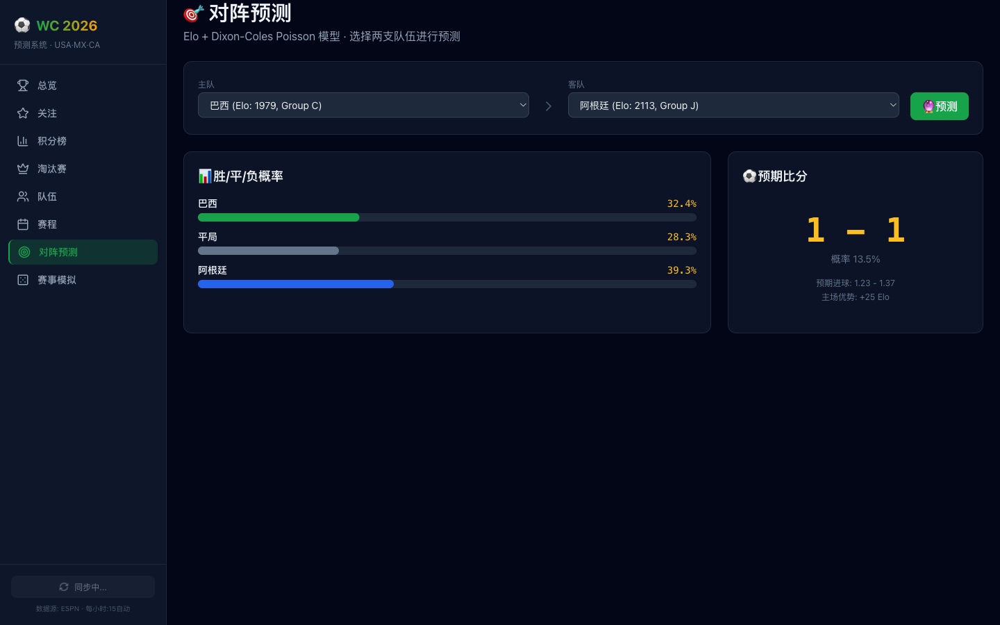

# 一个人用 AI 写了个世界杯预测系统

2026 年世界杯还有 365 天。我花了两个晚上，让 AI 给我写了一套完整的预测系统——实时比分、Elo 评分、蒙特卡洛模拟、夺冠概率，还附带一个把比赛塞进 macOS 日历的命令行工具。

整套代码已经开源在 GitHub。这篇文章讲讲怎么做的，以及踩了哪些坑。

## 先看效果

系统分前后端，跑在本机两个端口上：

- 后端 FastAPI（8570）：预测引擎 + ESPN 数据同步
- 前端 React + Vite（5570）：八个页面，全中文界面

打开就是总览页：赛事进度、实时积分榜、夺冠热门概率条、Elo 评分 Top 10。


积分榜按小组展示，已完成比赛用绿色边框标记，实时更新：


淘汰赛页面单独做了，24 场对阵按时间排列，场地城市一目了然：



## 预测引擎：三层模型叠加

核心不是调 API 拉数据，而是**自己算**。引擎分三层：

**第一层 Elo 评分。** 每支球队有一个 Elo 值，初始值参考 FIFA 排名和历史战绩。每场比赛打完，赢了加分输了扣分，用标准的 Elo 公式：

```
R_new = R_old + K × (actual - expected)
```

K 值我设的 30，世界杯级别比赛权重更高。expected 用 logistic 函数算，考虑主客场优势（东道主 USA/Mexico/Canada 有 65 分加成）。

**第二层 Dixon-Coles 泊松模型。** 两队对阵时，预期进球数 λ 用一个对数线性模型：

```
λ_home = α_attack(home) + β_defense(away) + γ_home_advantage
```

然后泊松分布采样得到比分概率矩阵。这里用 Dixon-Coles 而不是纯泊松，是因为它修正了一个经典问题：0-0 和 1-1 的概率被纯泊松低估了，有个 ρ 参数专门调这个。

**第三层蒙特卡洛模拟。** 从小组赛一路模拟到决赛，跑 10000 次，统计每支球队在每轮被淘汰的概率。这就是总览页那个夺冠概率条的来源。

整个预测引擎大概 600 行 Python，不依赖任何外部预测服务。

## 实时比分：ESPN 单次 API

数据源用的 ESPN，免费、不需要 key、有世界杯数据。

一开始我按天循环调用 API，39 天就 39 个 HTTP 请求。每次同步要跑十几秒，偶尔超时。后来发现 ESPN 支持区间查询：

```
https://site.api.espn.com/apis/site/v2/sports/soccer/fifa.world/scoreboard?dates=20260611-20260719
```

一次请求拿回 100 场比赛的数据，小组赛和淘汰赛都在里面。同步时间从十几秒降到 4 秒。

数据格式上有个细节：小组赛的 `altGameNote` 是 "FIFA World Cup, Group A"，淘汰赛只有 "FIFA World Cup"。用这个字段就能区分两种赛制，拆开存储。

同步频率用的 APScheduler，每小时第 15 分钟触发一次，只在比赛日期间有效。比赛日定义是 ESPN 返回的 events 列表非空。

## 预测对阵页

选两支队伍，立刻算出比分概率矩阵：


热力图里颜色越深代表那个比分概率越高。最下面还有胜/平/负的三项概率。

## 赛事模拟页

一键跑 10000 次蒙特卡洛，输出夺冠/亚军/四强/十六强概率：


## 移动端适配

系统在手机上也能用，侧边栏收成抽屉式：


点右上角菜单展开导航：



用了纯 CSS 的 `lg:` 断点，没有引入额外的 UI 库。桌面端侧边栏固定，移动端滑入滑出，React state 管开关，路由变化自动关闭。

## 命令行工具：关注球队 → 日历

这部分我最满意。写了一个独立的 bash 脚本，不依赖后端：

```bash
$ follow_calendar.sh BRA ARG --dry-run

Fetching from ESPN API...
  Fetched + cached successfully
  Backend prediction system synced

=== 8 matches found (ESPN live data) ===

  06/14 Sun 06:00 | 巴西 1-1 摩洛哥 | C组 | MetLife Stadium
  06/17 Wed 09:00 | 阿根廷 3-0 阿尔及利亚 | J组 | Arrowhead Stadium
  06/20 Sat 08:30 | 巴西 3-0 海地 | C组 | Lincoln Financial Field
  06/23 Tue 01:00 | 阿根廷 2-0 奥地利 | J组 | AT&T Stadium
  06/25 Thu 06:00 | 苏格兰 0-3 巴西 | C组 | Hard Rock Stadium
  06/28 Sun 10:00 | 约旦 vs 阿根廷 | J组 | AT&T Stadium
  06/30 Tue 01:00 | 巴西 vs F组第2 | 淘汰赛 | NRG Stadium
  07/04 Sat 06:00 | 阿根廷 vs H组第2 | 淘汰赛 | Hard Rock Stadium

[DRY RUN] No calendar events created.
```

去掉 `--dry-run` 就是真写入 macOS 日历。用 AppleScript 操作 Calendar.app，每个事件带比赛时间、场馆、城市、对阵、比分（如果已踢完）。

几个设计点：

**中文名映射。** ESPN 返回的是 "Brazil"，日历事件里要显示"巴西"。维护了一个 1KB 的 JSON 映射表，48 支队伍全覆盖。

**淘汰赛占位符。** 淘汰赛对阵在小组赛没打完时是 "Group F 2nd Place" 这种占位符，需要翻译成"F组第2"。小组第三的规则更复杂，"Third Place Group A/B/C/D/F" 被翻译成"小组第3(A/B/C)"。

**幂等。** 同一队可以重复导入，不会产生重复事件。AppleScript 用事件标题 + 开始时间做去重键。

**后端联动。** 脚本启动时尝试 ping 一下后端 `/api/sync/refresh`，触发数据同步。后端没开就跳过，不影响日历导入。30 秒超时保护。

**离线模式。** 加 `--cache` 参数用上次缓存的 ESPN 数据，没网也能跑。

## 关注球队页

网页版也做了关注功能。输入球队名，立刻看到该队所有比赛：



网页端的关注不走日历，是纯展示。日历导入由命令行工具负责，职责分离。

## 部署架构

整个项目结构：

```
worldcup-2026/
├── backend/
│   ├── app/
│   │   ├── main.py              # FastAPI + APScheduler
│   │   ├── services/
│   │   │   ├── predictor.py     # Elo + Dixon-Coles + Monte Carlo
│   │   │   └── sync_service.py  # ESPN 单次 API
│   │   └── data/
│   │       ├── teams.json       # 48 队元数据
│   │       └── fixtures.json    # 自动生成，gitignored
│   └── requirements.txt
├── frontend/
│   ├── src/
│   │   ├── components/AppLayout.tsx
│   │   ├── contexts/SyncContext.tsx
│   │   └── pages/               # 8 个页面
│   └── package.json
└── README.md
```

fixtures.json 不入库，因为它是同步生成的，包含实时比分。teams.json 入库，包含 48 支队伍的初始 Elo、FIFA 排名、所属大洲。

后端用 `.venv/` 隔离依赖，一行命令启动：

```bash
cd backend && PYTHONPATH=. .venv/bin/python -m uvicorn app.main:app --host 0.0.0.0 --port 8570
```

前端标准 Vite：

```bash
cd frontend && npx vite --port 5570 --host
```

## 踩过的坑

**Python 缓存失效。** 一开始 predictor 里有个 `_fixtures_cache` 变量，同步完数据想清空它，用 `from services.predictor import _fixtures_cache; _fixtures_cache = None`。结果只是重新绑定了局部变量名，模块里的原始变量没变。改成在模块里写 `invalidate_cache()` 函数，用 `global` 声明才解决。

**f-string 里的反斜杠。** Python 3.10 不允许 f-string 表达式里出现 `\u`，正则替换 `\g<1>` 在 f-string 里直接报错。解法是把正则的 replacement 部分提到 f-string 外面，用 lambda 替代字符串。

**ESPN 单次请求的精度。** 100 场比赛在一个 JSON 里，解析时要区分小组赛和淘汰赛。起初用有没有 group 字段判断，后来发现淘汰赛占位符队伍名不稳定，最终用 `altGameNote` 字段更可靠。

## 开源

代码已经放到 GitHub：

`https://github.com/includewudi/worldcup-2026`

README 里有完整的部署教程，包括后端、前端、命令行工具三种独立使用方式。命令行工具甚至可以脱离整个系统单独跑，只要有 ESPN API 和 macOS。

世界杯还有一年，到时候拿这个系统跟朋友打赌应该够用。
